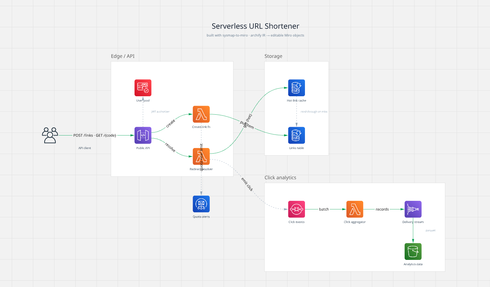

# sysmap-to-miro

**Turn a codebase or system description into editable Miro components — shapes,
connectors, and frames you can move and edit, not a screenshot. Choose your icon
set (AWS · GCP · Azure · custom). Built on [archify](https://github.com/tt-a1i/archify).**

Most "diagram → Miro" flows drop a flat image on the board. `sysmap-to-miro`
materializes the *structure*: archify builds and validates a typed system map
(components, connections, boundaries, with geometry), and this skill converts that
IR into native Miro objects you can actually edit.



<sub>The `url-shortener` example, materialized on a Miro board — AWS icons, labelled connectors, and boundaries as titled zones. Everything is a real, editable Miro object.</sub>

## Install

```bash
npx skills add xiuliangsong/sysmap-to-miro
```

Then restart your agent.

## Requirements

- The **archify** skill (to generate the IR) — or an existing archify
  `*.architecture.json`.
- A **connected Miro MCP** (`/mcp` → authenticate `claude.ai Miro`).
- Node ≥ 18.

## Use

Ask your agent:

- "Put a system map of this repo on a Miro board."
- "Turn `docs/architecture.architecture.json` into an editable Miro board with AWS icons."
- "Editable architecture on Miro, GCP icons."

Under the hood:

```bash
# deterministic: archify IR -> neutral board plan (frames + nodes + connectors)
node bin/ir-to-miro.mjs path/to/system.architecture.json --iconset aws
```

The skill then creates the board and materializes the plan via the Miro MCP
(`layout_create` for native shapes/connectors/frames; `image_create` per node for
provider icons).

## Icon sets

| `--iconset` | On the board |
| --- | --- |
| `none` (default) | Native Miro shapes — fully editable, no provider icons |
| `aws` / `gcp` / `azure` | Official provider icons per component + native connectors |
| `custom` | Your own icons — edit `icons/map.json` |

The type→icon mapping is in [`icons/map.json`](icons/map.json); swap `--iconset`
to re-render the same map in any set.

## How it works

1. **archify** → validated `*.architecture.json` (components/connections/boundaries + geometry).
2. **`bin/ir-to-miro.mjs`** → neutral board plan (JSON).
3. **Miro MCP** → `board_create` + `layout_create` (+ `image_create` for icons).

archify draws no icons itself — the icon sets live in this skill's render step.

## Examples

Two worked, invented system maps in [`examples/`](examples/) —
[`url-shortener`](examples/url-shortener.architecture.json) and
[`ecommerce-checkout`](examples/ecommerce-checkout.architecture.json) — each with
its input IR and the board plan the converter produces. Walkthrough in
[examples/README.md](examples/README.md).

```bash
node bin/ir-to-miro.mjs examples/url-shortener.architecture.json --iconset aws
```

## License

MIT — see [LICENSE](LICENSE).
